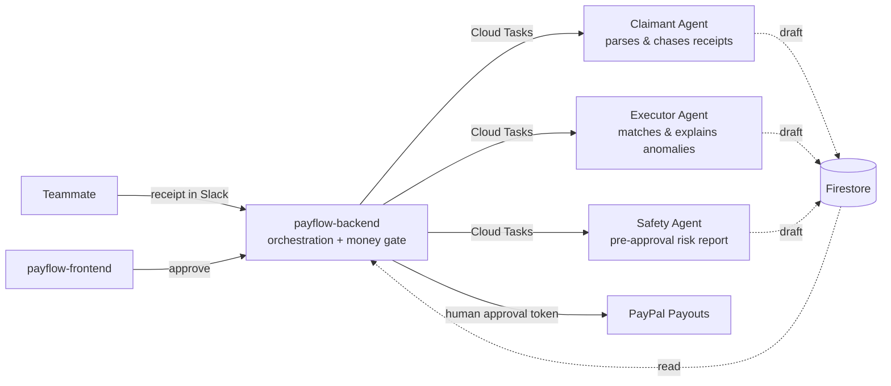

# Payflow

**An autonomous expense-settlement agent for small teams.**
Payflow reconciles receipts against a PayPal ledger, drafts a settlement, and — once a human approves — pays everyone in one batch through PayPal Payouts.

Built for the **[All Things Agentic Hackathon](https://allthingsagentichackathon.devpost.com/)** (Taskmaster category) by a 3-person team.

---

## The problem

At a small startup, someone still spends hours every month chasing teammates for receipts, matching them against the PayPal statement by hand, and building a spreadsheet before wiring reimbursements one by one. Payflow turns that into: *receipt comes in → agent tracks it down and classifies it → a settlement draft appears → one human clicks approve → money moves.*

## How it works

Three specialized agents (claimant, executor, safety) run on **Google ADK + Gemini**, each invoked by the backend through Cloud Tasks — they never call each other directly, and none of them can move money. Every settlement passes through a code-level approval gate before a payout fires.

### Non-negotiable rules

1. **The agent service never touches PayPal credentials** — enforced by IAM, not by code convention.
2. **No payout endpoint runs without a human approval token**, and that token never enters an LLM's context.
3. **LLMs never compute amounts.** Agents write the reasoning; code does the arithmetic.

## Repositories

| Repo | Role | Stack |
|---|---|---|
| [`payflow-frontend`](https://github.com/park-song-jungyujin/payflow-frontend) | Approval dashboard, natural-language settlement filters | Next.js / TypeScript, Cloud Run |
| [`payflow-backend`](https://github.com/park-song-jungyujin/payflow-backend) | Orchestration, matching, approval gate, PayPal Payouts | FastAPI / Python, Cloud Run |
| [`payflow-agent`](https://github.com/park-song-jungyujin/payflow-agent) | Claimant / executor / safety agents | Google ADK / Python, Cloud Run |
| [`payflow-docs`](https://github.com/park-song-jungyujin/payflow-docs) | Shared schema contract, architecture rules, working docs | — |

`payflow-docs` is pulled into the other three repos as a git submodule so the schema contract and rules stay in sync across the polyrepo.

## Tech stack

- **AI**: Gemini (Vertex AI), Google ADK
- **Infra**: Google Cloud Run, Firestore, Cloud Tasks, Secret Manager, Terraform
- **Payments**: PayPal Payouts API
- **Frontend**: Next.js
- **Backend**: FastAPI

## Team

| Track | Owner | Scope |
|---|---|---|
| Claimant experience | 정유진 | Slack intake → receipt parsing → claim confirmation |
| Executor experience | 박수현 | Matching → settlement dashboard → approval cards |
| Money & safety | 송재훈 | Approval tokens, payout gate, PayPal integration, infra |

## Status

🚧 Active development — submission deadline **2026-09-01 09:00 KST**. See each repo's README for setup instructions.
